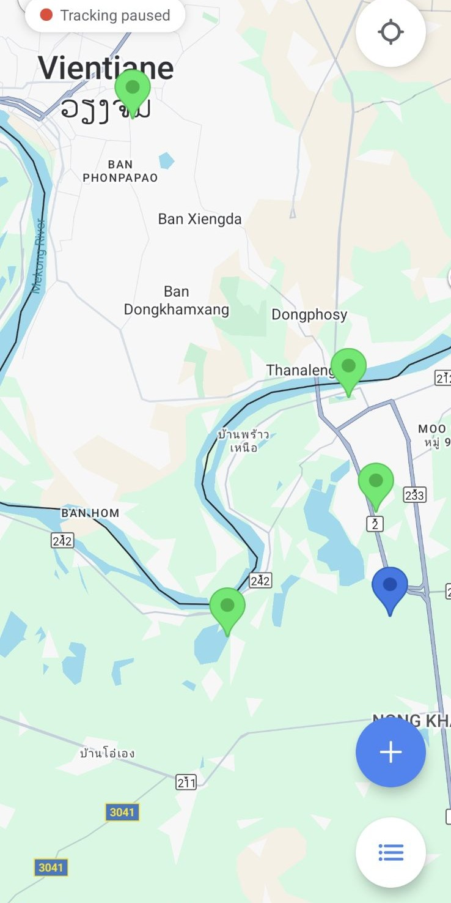
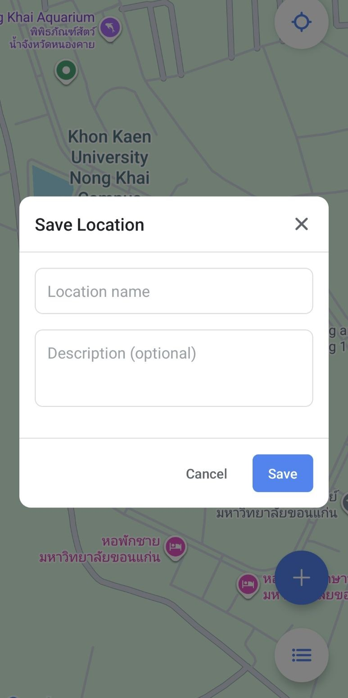
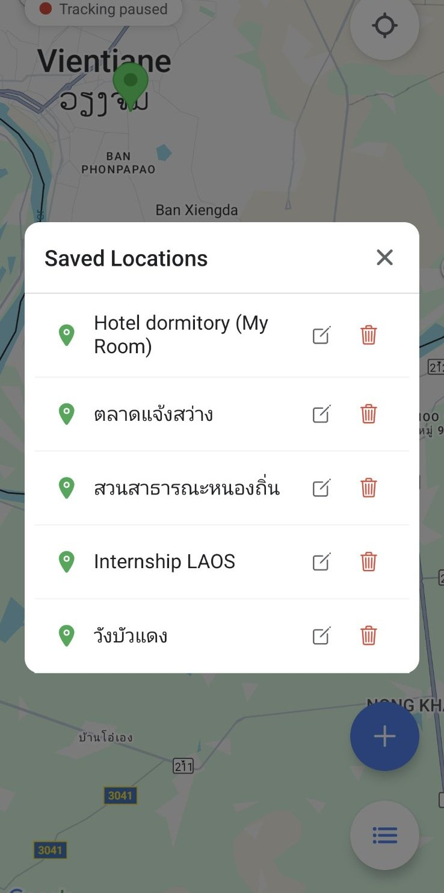

# 📍 Saved Places Map App

A **React Native** app using **Expo** and **react-native-maps** that allows users to:

- Track **real-time location** with a blue dot
- **Save places** with name and description
- **View, edit, and delete** saved places
- Easily **recenter map** to current location
- Use **Floating Action Buttons (FAB)** for main actions

> A clean, mobile-friendly map app designed for quick location saving.

---

## 🛠 Features

- **Real-time User Location**: Blue circle + marker
- **Save Current Location**: Name & description via modal
- **Saved Places List**: Tap to go to location
- **Edit / Delete** saved places
- **Recenter Map**: Return to current location instantly
- **Clean UI**: Floating Action Buttons + icon-based interface

---

## 📱 Screenshots

| Map View | Add Place Modal | No Saved Places List | Saved Places List |
|----------|----------------|--------------------|-----------------|
|  |  |  |  |

---

## 🚀 Installation

```bash
# Install Expo CLI if not installed
npm install -g expo-cli

# Clone repository
git clone https://github.com/Onpreeya-Jantakote/location-map.git
cd location-map

# Install dependencies
npm install

# Start Expo
npx expo start

# Scan QR code with Expo Go (iOS/Android) to run